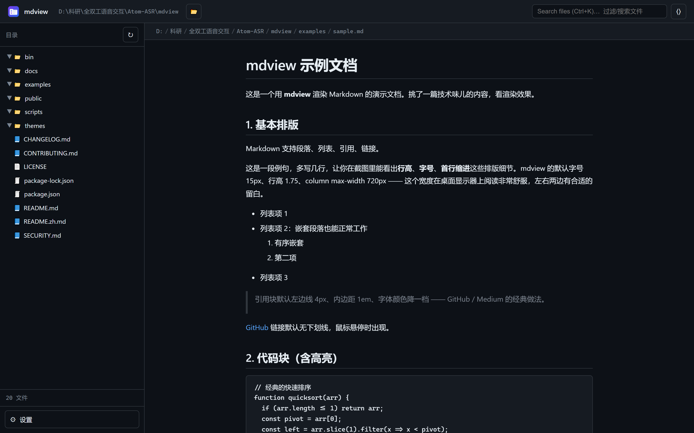
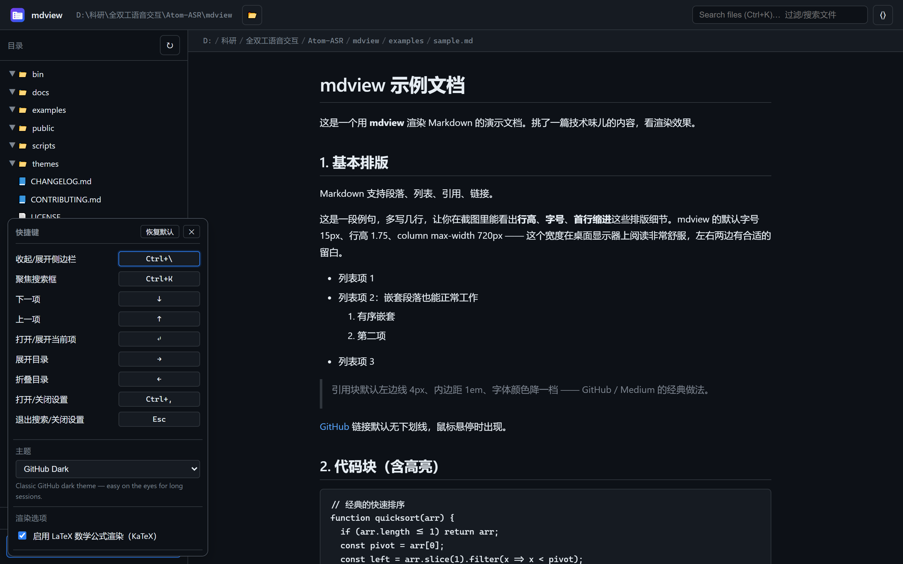
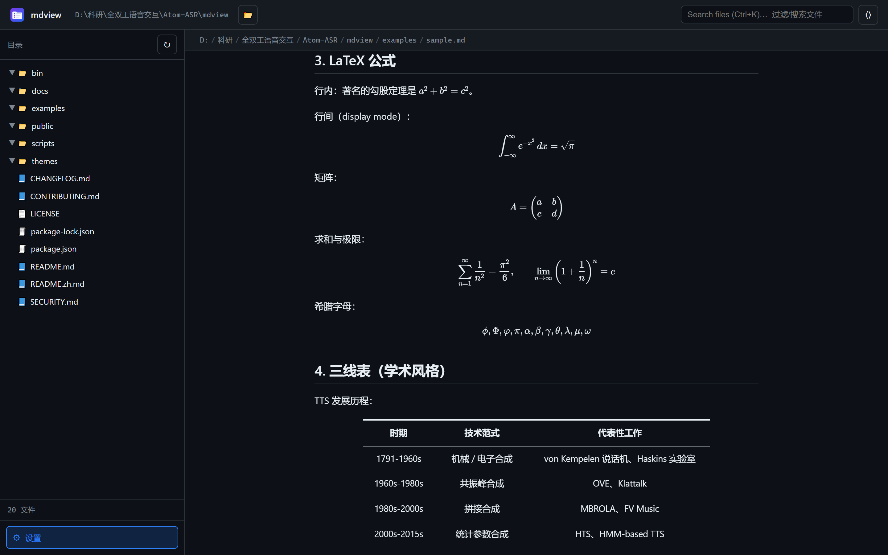
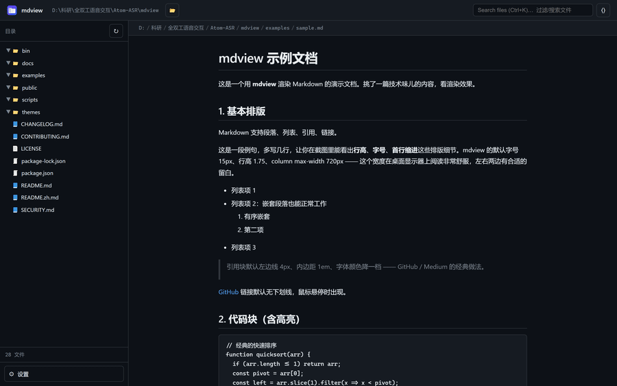

<p align="center">
  
</p>

<h1 align="center">mdview</h1>

<p align="center">
  <a href="./README.zh.md">中文</a> · English
</p>

<p align="center">
  A portable, opinionated Markdown viewer that runs in your browser.<br>
  File tree · Themes · LaTeX · Native folder picker · Customisable shortcuts.
</p>

<p align="center">
  
  
  
</p>

> **Why mdview?** In the AI era we constantly receive Markdown ï¿?task briefs,
> research notes, agent outputs, exported chats. We just want to **read** them
> cleanly, without launching a heavy editor, syncing an account, or installing
> a browser extension. Existing Markdown viewers are either over-featured
> (IDEs that want you to commit) or under-featured (a wall of unstyled text).
> mdview is the missing middle ground: open any folder, read comfortably,
> switch themes, render math, and never touch the file.

<p align="center">
  
</p>

<p align="center">
  <a href="docs/screenshots/screenshot-settings.png"></a>
  <a href="docs/screenshots/screenshot-latex.png"></a>
</p>

<p align="center">
  
</p>

---

`mdview` is a single-binary-feel CLI tool: start it in any folder and a browser
window opens, showing a file tree on the left and a rendered Markdown document
on the right. Browse any folder at runtime via the 📂 button �no
restart required.

It is built to read **exactly one thing** (your local Markdown files) and do it
really well: with proper typography, math rendering, themes, and a hundred small
touches that make long-form reading comfortable.

## Features

| | |
|--|--|
| 📂 **File tree** with keyboard navigation, fuzzy filter, and live refresh | |
| 📖 **GFM Markdown** with code highlighting (highlight.js) and safe HTML (DOMPurify) | |
| 🔢 **LaTeX** (`$...$` and `$$...$$`) via KaTeX �toggle on/off | |
| 📊 **Three-line tables** (academic style) with centred text | |
| � **Themes** as JSON files �ship your own, four included by default | |
| 🔠 **Fonts** �4 presets + scan of 270+ system fonts via `datagrid` | |
| ⌨� **Customisable shortcuts** (9 actions, conflict detection) | |
| ⚙� **Settings panel** at bottom-left �no modal spam | |
| 🌗 **Auto dark mode** that follows your OS | |
| 🪟 **Native folder picker** (Windows / macOS / Linux) | |
| 💾 **Persistent** �all your choices live in `localStorage` | |

## Install

### From npm (recommended)

```bash
# Run mdview in the current directory without installing globally:
npx @ap01lo/mdview

# Or install once and use anywhere:
npm install -g @ap01lo/mdview
mdview
```

Requires Node.js **ï¿?18**.

### From source

```bash
git clone https://github.com/ap01lo/mdview.git
cd mdview
npm install
npm link          # optional ï¿?registers the `mdview` global command
```

### Requirements

- Node.js **ï¿?18**
- A modern browser (Chromium, Firefox, Safari, Edge)

## Usage

```bash
mdview                       # open the current directory
mdview ./docs                # open a relative path
mdview D:\projects\notes     # open an absolute path
mdview --port 8080           # custom port (default: auto-pick)
mdview --theme serif-light   # default theme
mdview --no-open             # don't auto-open the browser
mdview --host 0.0.0.0        # bind on all interfaces (LAN access)
mdview --help                # full help
```

When the server is running, click **📂** in the title bar (or click the
current path) to switch directories at any time ï¿?mdview will pop up a native
folder dialog.

## Keyboard shortcuts

| Key | Action |
|--|--|
| `Ctrl/ï¿?+ \` | Toggle sidebar |
| `Ctrl/ï¿?+ K` | Focus search |
| `Ctrl/ï¿?+ ,` | Open settings |
| `↑` / `↓` | Move in tree |
| `→` / `�` | Expand / collapse directory |
| `Enter` / `Space` | Open file |
| `Tab` / `Shift+Tab` | Move focus |
| `Esc` | Close settings / blur search |

All of these are rebindable in the settings panel.

## Themes

Themes live in `themes/*.json`. Each file defines CSS variables that mdview
applies to the document at runtime:

```json
{
  "name": "My Theme",
  "description": "Tweaked GitHub look",
  "vars": {
    "--bg": "#ffffff",
    "--fg": "#1f2328",
    "--accent": "#0969da",
    "--content-max": "720px",
    "--md-line-height": "1.75",
    "--md-table-top": "2px solid #1f2328",
    "--md-table-align": "center"
  }
}
```

Add a new file in that directory and it appears in the theme selector with no
restart required.

## Security & md-defence

- File access is strictly bounded to the currently mounted directory.
- Path traversal attacks (`..`, absolute paths) are rejected with 403.
- Files larger than 5 MB are rejected with 413.
- All HTML rendered to the page goes through DOMPurify.

## Project layout

```
mdview/
├── bin/mdview.js          CLI entry + Express server
├── public/                SPA (HTML, CSS, JS, SVG icon)
�  ├── index.html
�  ├── style.css
�  ├── app.js
�  └── favicon.svg
├── themes/                Built-in themes
�  ├── github-light.json
�  ├── github-dark.json
�  ├── serif-light.json
�  └── noir.json
├── package.json
├── LICENSE
└── README.md
```

## Contributing

Issues and PRs welcome. Please keep PRs focused ï¿?mdview is small on purpose.

When adding a new theme, also include a short description in the JSON; it shows
up next to the theme selector.

To cut a release, see [PUBLISHING.md](./PUBLISHING.md).

## License

MIT ï¿?see [LICENSE](./LICENSE).

---

<p align="center">
  <sub>中文版：<a href="./README.zh.md">README.zh.md</a></sub>
</p>